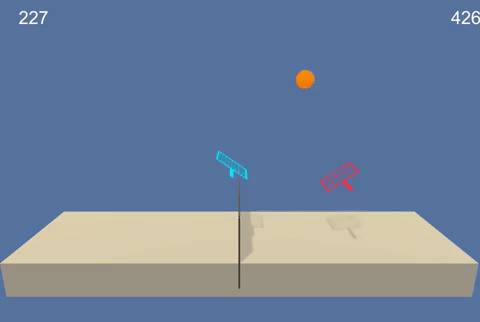

# P3. Collaboration and Competition
I will train agents to play tennis to keep as long rally as possible.



The goal of my agents is to keep the goal state hitting balls.
- Reward = +0.1 if an agent hits the ball over the net
- Reward = -0.01 if an agent lets a ball hit the ground or hits the ball out of bounds. 

- The state space: 8 dimension
- algorithm modulates: the position and velocity of the ball and rackets

For actions, two dimensional vectors are used.

## Getting started:
### 1. Install all the requirements from the requirements.txt
```bash
pip install -r requirements.txt
```
### 2. Install the Unity environment

Two Agents
- Linux: [click here](https://s3-us-west-1.amazonaws.com/udacity-drlnd/P3/Tennis/Tennis_Linux.zip)
- Mac OSX: [click here](https://s3-us-west-1.amazonaws.com/udacity-drlnd/P3/Tennis/Tennis.app.zip)
- Windows (32-bit): [click here](https://s3-us-west-1.amazonaws.com/udacity-drlnd/P3/Tennis/Tennis_Windows_x86.zip)
- Windows (64-bit): [click here](https://s3-us-west-1.amazonaws.com/udacity-drlnd/P3/Tennis/Tennis_Windows_x86_64.zip)

### 3. start the program

You can run a program to train agents.
Please check the detail in 'Tennis.ipynb' file and 'report.ipynb' file.
